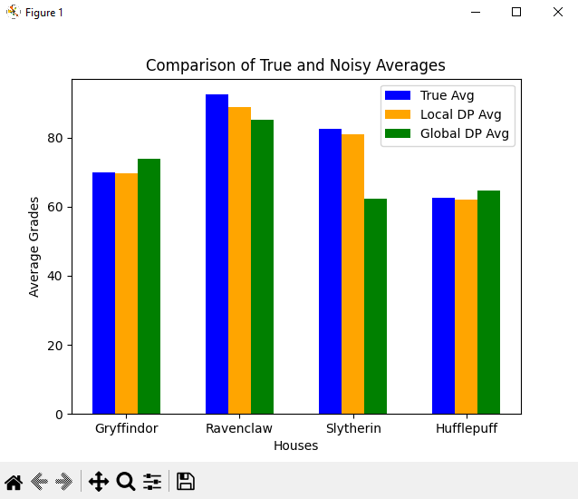
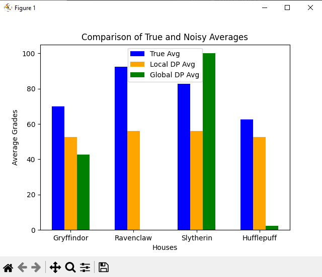
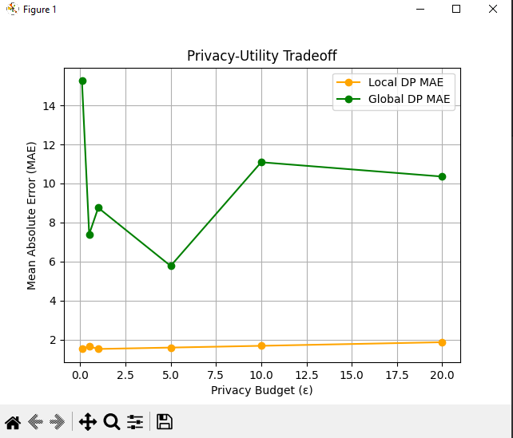
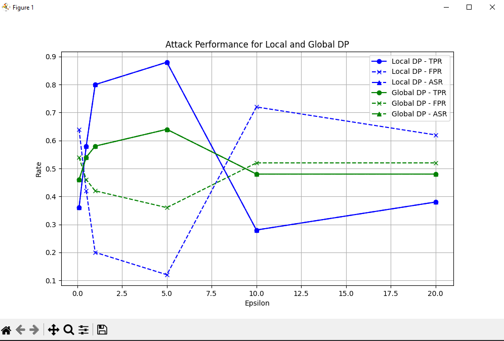

# 🧙‍♀️ Data Analysis Project for Hogwarts Students 🧙‍♂️ 

## 🦉 Overview 🦉
At the Ministry, we are conducting a data analysis project tailored for the students of Hogwarts. This initiative uses differential privacy to safeguard individual privacy while uncovering meaningful trends and insights. By introducing controlled noise into the results, we ensure that no specific student's information can be identified, fostering trust and maintaining confidentiality. This method strikes a balance between protecting privacy and preserving data utility, enabling the secure sharing of aggregated insights.

## 📚 Table of Contents

- [🦉 Overview](#Overview)
- [🤔 What is Differential Privacy?](#what-is-differential-privacy)
- [⚡️ Installation](#installation)
- [⚡️ Run Program](#run-program-depending-on-scenario)
- [🖼️ Screenshots](#screenshots)
- [📜 Conclusion](#conclusion)

## What is Differential Privacy?

Differential privacy is a rigorous mathematical definition of privacy for statistical analysis and machine learning. In the simplest setting, consider an algorithm that analyzes a dataset and releases statistics about it (such as means and variances, cross-tabulations, or the parameters of a machine learning model). Such an algorithm is said to be differentially private if by looking at the output, one cannot tell whether any individual's data was included in the original dataset or not.

For more information on OpenDP, a popular open-source library for implementing differential privacy, visit the [OpenDP project page](https://opendp.org/about#:~:text=Differential%20privacy%20is%20a%20rigorous,of%20a%20machine%20learning%20model).).

### Scenario 1: 🧝‍♂️ House Elf Working Conditions 🧝‍♀️

**Use Case:** Surveying house elves anonymously about working conditions at Hogwarts.  

**Challenge:** House elves fear their masters discovering critical feedback about working hours or conditions.  

**Solution:** Use Differential Privacy (DP) to aggregate survey results.  

### Scenario 2: 🦁 Student Performace Analysis Across Houses 🐍

**Use Case:** Comparing academic performances across different houses.  

**Challenge:** Students might fear that their house reputation could be negatively impacted if data about lower-performing houses is released.  

**Solution:** Implement differential privacy to release only aggregated data on overall performances across houses. This way, the system can show trends without revealing individual student results, maintaining house loyalty and preventing possible stigma associated with poor performance in a particular house.  


## Installation 

To get started with the project, you'll need to set up a virtual environment and install the
required dependencies. Follow the steps below to set up your environment.

WARNING: Apple Silicon does not work. x86 machines only. ⚠️

### 1. 🧪 Create a Virtual Environment 🧪

Ensure that you have Python 3.7+ installed on your system.
```bash
python3 -m venv venv
```

### 2. 🔮 Activate Virtual Environment 🔮

```bash
source /venv/bin/activate
```
You should notice a change in your terminal prompt. It should now display (venv) at the beginning, indicating that the virtual environment is active.

### 3. 📜 Install Dependencies 📜
```bash
pip install -r requirements.txt
```

## Run Program depending on scenario
```bash
python3 elfhours.py
```
```bash
python3 houseavg.py
```
```bash
python3 membership_attack.py
```
NOTE: For the membership_attack plots, the first plot will be shown in a window. To see the following plots, close the current window, and the next plot will appear.


## Screenshots
<figure>
  <figcaption>This chart shows the comparisons of true calculated averages compared to their local and global DP counterparts. Given the (𝜖) value of 10.</figcaption>
  
</figure>

<figure>
  <figcaption>This chart shows given a low (𝜖) the utlity of the data is not useable. Given the (𝜖) value of 0.5. </figcaption>
  
</figure>

<figure>
  <figcaption> 
    This chart shows the relationship of (ε) and the utility of the data provided. The lower (ε) value
    the lower the utlity is compared to a high (ε) the utlity of data is high but the privacy is low.
  </figcaption>
  
</figure>

<figure>
  <figcaption>Need to do.</figcaption>
  
</figure>

## Conclusion

Throughout this process of learning differential privacy, we have learned the difficulties of preserving the balance of utility and the privacy of the students at Hogwarts. The most important  lesson we learned throughout this project was the balance of utility and privacy is not as easy as it seems. It requires selecting careful privacy parameters, understanding the data well enough and ensuring that the data produced meets both standards of utility and privacy.

The implementation of local and global differential privacy using the OpenDP library shows the trade-offs of both approaches. Local differential privacy produces privacy on the individual level and global differential privacy offers privacy at the group level. 

(talk about the privacy and utility.png)

Difficulties we encountered included mostly the usage of the OpenDP library. Installing and running the base example tests proved to be difficult as the library does not work with Apple Silicon chips. Fine Tuning the epsilon value for our data as we conclude that the epsilon value of 10 workings provides great privacy and utility. As shown in the image where epsilon has a value of 0.5, the utility of the data is unusable for the students at Hogwarts.

In terms of our future studies of Differential Privacy, we would like to see how a generative AI model would interact with differential privacy data. Specifically we would aim at how privacy-preserving techniques would affect the model’s ability to generate accurate results.
